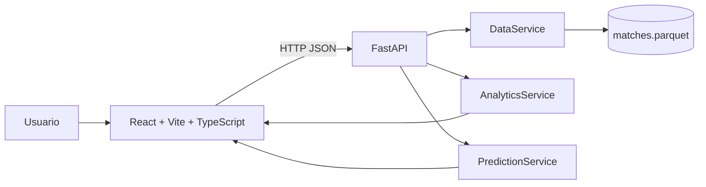

# Predict IO

> Un laboratorio local para leer el fútbol europeo como datos: contexto, forma, comparación y probabilidad antes del partido.

Predict IO es una aplicación full-stack para explorar resultados históricos de fútbol europeo y generar análisis comparables por competencia, equipo y temporada. Está diseñada para ejecutarse localmente, con una interfaz visual compacta y una API preparada para alimentar otros clientes.


## Índice

- [Qué resuelve](#qué-resuelve)
- [Funcionalidades](#funcionalidades)
- [Arquitectura](#arquitectura)
- [Datos](#datos)
- [Predicción](#predicción)
- [Requisitos](#requisitos)
- [Arranque con Docker](#arranque-con-docker)
- [Desarrollo local](#desarrollo-local)
- [Configuración](#configuración)
- [API](#api)
- [Estructura del proyecto](#estructura-del-proyecto)
- [Calidad y verificación](#calidad-y-verificación)
- [Solución de problemas](#solución-de-problemas)
- [Próximos pasos](#próximos-pasos)
- [Fuente y atribución](#fuente-y-atribución)

## Qué resuelve

Una misma competencia o equipo no significa necesariamente lo mismo en todas las temporadas. Predict IO conserva ese contexto y permite analizar el dato con una identidad compuesta:

- Competencia + temporada.
- Equipo + competencia + temporada.
- Partido + fecha + estado + resultado.

El sistema puede funcionar en dos modos:

| Modo         | Cuándo se usa                 | Fuente                                             |
| ------------ | ----------------------------- | -------------------------------------------------- |
| Demo         | No existe un parquet local    | Dataset sintético reproducible generado en backend |
| Datos reales | Existe `data/matches.parquet` | Archivo parquet montado en el contenedor           |

El modo demo permite revisar toda la aplicación antes de descargar o montar datos reales.

## Funcionalidades

### Competencias

- Listado de competiciones disponibles.
- Área, tipo, código, cantidad de partidos y temporadas.
- Resumen de partidos, goles, promedio y empates.
- Comparación de dos competencias.
- Filtro opcional por temporada en API.

### Equipos

- Listado por competencia y temporada.
- Resumen de partidos, victorias, empates, derrotas, puntos y goles.
- Indicadores de goles a favor y en contra.
- Comparación entre dos equipos.
- Diferencia de goles a favor y puntos por partido.

### Versus

- Selección de local y visitante.
- Probabilidades de victoria local, empate y victoria visitante.
- Goles esperados.
- Marcador más probable.
- Probabilidad de más de 2.5 goles.
- Probabilidad de que ambos equipos marquen.
- Nivel de confianza cualitativo.

### Plataforma

- API documentada automáticamente por FastAPI.
- Endpoint de salud y metadatos del dataset.
- CORS configurable.
- Docker Compose para levantar frontend y backend juntos.
- Frontend responsive sin rutas: navegación por módulos en una única pantalla.

## Arquitectura



### Backend

- **FastAPI**: HTTP, validación de entrada y documentación OpenAPI.
- **Pydantic**: esquemas de petición y respuesta.
- **pandas**: carga, normalización, filtros y agregaciones.
- **pyarrow**: lectura del parquet.
- **scikit-learn**: dependencia preparada para modelos supervisados y evolución del predictor.

### Frontend

- **React** para composición de la interfaz.
- **Vite** para desarrollo y build.
- **TypeScript** para contratos del cliente.
- **Tailwind/PostCSS** junto con CSS de dominio para la identidad visual.
- **lucide-react** para iconos de navegación.

## Datos

El backend busca por defecto el archivo:

```text
/data/matches.parquet
```

En desarrollo local, la ruta equivalente es:

```text
data/matches.parquet
```

Columnas principales utilizadas por la aplicación:

| Grupo       | Campos                                                                         |
| ----------- | ------------------------------------------------------------------------------ |
| Partido     | `id`, `utcDate`, `status`, `matchday`, `stage`, `group`                        |
| Competencia | `competition.id`, `competition.name`, `competition.code`, `competition.type`   |
| Temporada   | `season.id`, `season.startDate`, `season.endDate`, `source_season`             |
| Local       | `homeTeam.id`, `homeTeam.name`, `homeTeam.shortName`, `homeTeam.tla`           |
| Visitante   | `awayTeam.id`, `awayTeam.name`, `awayTeam.shortName`, `awayTeam.tla`           |
| Marcador    | `score.winner`, `score.duration`, `score.fullTime.home`, `score.fullTime.away` |
| Procedencia | `source_competition`, `source_season`                                          |

La carga normaliza las columnas de fecha y resultado en campos internos como `matchDate`, `homeGoals`, `awayGoals`, `homeTeamId`, `awayTeamId`, `competitionCode` y `seasonKey`.

### Descargar el parquet

```python
import kagglehub

path = kagglehub.dataset_download(
	"adrianjuliusaluoch/live-european-football-match-results"
)
print("Path to dataset files:", path)
```

Después, coloca el archivo final en `data/matches.parquet`. La carpeta `data/` está ignorada por Git porque puede contener archivos grandes o datos locales.

## Predicción

La versión actual calcula una predicción explicable a partir de:

1. Promedio de goles del equipo local.
2. Promedio de goles del equipo visitante.
3. Ajuste de ventaja local y visitante.
4. Diferencia de puntos por partido.
5. Distribución de Poisson aproximada para mercados de goles.

El resultado debe interpretarse como una señal analítica, no como una garantía ni como asesoramiento de apuestas. La API expone el método usado para que el usuario pueda distinguir una predicción del modelo de un resultado observado.

`scikit-learn` está incluido para evolucionar esta capa hacia entrenamiento, evaluación y versionado de modelos. El predictor actual no entrena un `RandomForestClassifier` en cada petición.

## Requisitos

### Para Docker

- Docker Engine 24 o superior.
- Docker Compose v2.
- Al menos 2 GB de memoria disponible para las imágenes y dependencias.

### Para desarrollo local

- Python 3.12+ recomendado.
- Node.js 22+ recomendado.
- npm 10+.
- Git.

Python 3.14 también puede usar las versiones actuales de `backend/requirements.txt`, que seleccionan ruedas compatibles cuando están disponibles.

## Arranque con Docker

Desde la raíz del proyecto:

```bash
docker compose up --build
```

URLs disponibles:

| Servicio              | URL                              |
| --------------------- | -------------------------------- |
| Aplicación            | http://localhost:5173            |
| Documentación Swagger | http://localhost:8000/docs       |
| Documentación ReDoc   | http://localhost:8000/redoc      |
| Salud de la API       | http://localhost:8000/api/health |
| Metadatos             | http://localhost:8000/api/meta   |

Para arrancar en segundo plano:

```bash
docker compose up --build -d
```

Para detener los servicios:

```bash
docker compose down
```

Para reconstruir desde cero:

```bash
docker compose build --no-cache
docker compose up
```

## Desarrollo local

### Backend en Windows PowerShell

```powershell
cd backend
python -m venv .venv
.\.venv\Scripts\Activate.ps1
python -m pip install --upgrade pip
pip install -r requirements.txt
$env:PARQUET_PATH = "..\data\matches.parquet"
uvicorn app.main:app --reload --port 8000
```

### Backend en macOS/Linux

```bash
cd backend
python3 -m venv .venv
source .venv/bin/activate
python -m pip install --upgrade pip
pip install -r requirements.txt
export PARQUET_PATH=../data/matches.parquet
uvicorn app.main:app --reload --port 8000
```

### Frontend

En otra terminal:

```bash
cd frontend
npm install
npm run dev
```

La aplicación quedará disponible en http://localhost:5173.

Para generar y previsualizar una build de producción:

```bash
npm run build
npm run preview
```

## Configuración

### Backend

| Variable       | Valor por defecto       | Descripción                            |
| -------------- | ----------------------- | -------------------------------------- |
| `PARQUET_PATH` | `data/matches.parquet`  | Ruta del parquet que leerá el backend  |
| `CORS_ORIGINS` | `http://localhost:5173` | Orígenes permitidos separados por coma |

Ejemplo:

```env
PARQUET_PATH=/data/matches.parquet
CORS_ORIGINS=http://localhost:5173,https://mi-dominio.example
```

### Frontend

| Variable       | Valor por defecto           | Descripción        |
| -------------- | --------------------------- | ------------------ |
| `VITE_API_URL` | `http://localhost:8000/api` | URL base de la API |

Ejemplo:

```env
VITE_API_URL=http://localhost:8000/api
```

Las variables `VITE_*` se incorporan al bundle del navegador. No deben contener secretos.

## API

Todas las rutas de negocio usan el prefijo `/api`.

### Salud y metadatos

```http
GET /api/health
GET /api/meta
```

Ejemplo de salud:

```json
{
  "status": "ok",
  "demo": true,
  "rows": 48
}
```

### Competencias

```http
GET /api/competitions
GET /api/competitions/{code}?season=2024
GET /api/competitions/compare?first_code=PL&second_code=PD&season=2024
```

### Equipos

```http
GET /api/teams?competition_code=PL&season=2024
GET /api/teams/{team_id}?competition_code=PL&season=2024
GET /api/teams/compare?first_id=1&second_id=2&competition_code=PL&season=2024
```

### Predicción

```http
POST /api/predict
Content-Type: application/json
```

Body:

```json
{
  "home_team_id": 1,
  "away_team_id": 2,
  "competition_code": "PL",
  "season": 2024
}
```

La documentación interactiva completa está en `/docs`.

## Estructura del proyecto

```text
predict-io/
├── compose.yaml
├── README.md
├── .gitignore
├── data/
│   └── matches.parquet              # local, ignorado por Git
├── backend/
│   ├── dockerfile
│   ├── requirements.txt
│   └── app/
│       ├── main.py                  # aplicación y lifespan
│       ├── config.py                # configuración de entorno
│       ├── schemas.py               # contratos Pydantic
│       ├── api/routes.py            # endpoints HTTP
│       └── services/
│           ├── data_service.py      # parquet y datos demo
│           ├── analytics_service.py # métricas y comparaciones
│           └── prediction_service.py# predicción
└── frontend/
	├── dockerfile
	├── package.json
	└── src/
		├── App.tsx
		├── api.ts
		├── components/              # piezas compartidas
		└── modules/
			├── competencias/
			├── equipos/
			└── versus/
```

## Calidad y verificación

### Compilar frontend

```bash
cd frontend
npm run build
```

### Compilar sintaxis Python

```bash
cd backend
python -m compileall app
```

### Comprobar endpoints manualmente

```bash
curl http://localhost:8000/api/health
curl http://localhost:8000/api/competitions
curl "http://localhost:8000/api/teams?competition_code=PL"
curl "http://localhost:8000/api/teams/compare?first_id=1&second_id=2&competition_code=PL"
```

Antes de una entrega conviene verificar:

- Que el build del frontend termina sin errores.
- Que `/api/health` responde `200`.
- Que el parquet se carga con `demo: false` cuando está montado.
- Que los selectores de competencia y equipo devuelven datos.
- Que comparar y predecir producen una respuesta visible en la interfaz.

## Solución de problemas

### El backend responde `ModuleNotFoundError: No module named 'app'`

Ejecuta Uvicorn desde `backend`, no desde la raíz:

```bash
cd backend
uvicorn app.main:app --reload --port 8000
```

### La aplicación muestra datos demo

Comprueba que el archivo existe en:

```text
data/matches.parquet
```

En Docker, esa carpeta se monta como `/data` en modo lectura. También puedes comprobar la ruta efectiva con:

```bash
curl http://localhost:8000/api/health
```

### El frontend no conecta con la API

Comprueba que el backend está en el puerto 8000 y que `VITE_API_URL` apunta a:

```text
http://localhost:8000/api
```

Si cambias esa variable, reinicia el servidor de Vite porque se resuelve durante el build.

### Docker no encuentra el parquet

La carpeta debe existir antes de ejecutar Compose:

```bash
mkdir data
```

Después coloca allí `matches.parquet` y reconstruye o reinicia el backend.

### Cambié dependencias y Docker conserva una versión anterior

Reconstruye sin caché:

```bash
docker compose build --no-cache backend frontend
docker compose up
```

## Seguridad y límites

- La aplicación está pensada para uso local o despliegues controlados.
- No incluye autenticación ni autorización.
- No se deben enviar secretos al frontend mediante `VITE_*`.
- Los datos del parquet pueden tener licencias y condiciones propias; revisa la fuente antes de redistribuirlos.
- Las predicciones son estimaciones estadísticas y no garantizan resultados.
- Para producción se recomienda añadir autenticación, rate limiting, logging estructurado, observabilidad y validación de tamaño del parquet.

## Próximos pasos

- Entrenar un modelo supervisado reproducible con separación temporal train/test.
- Añadir métricas de evaluación: accuracy, log loss, Brier score y calibration curve.
- Incorporar más variables: localía, forma reciente, descanso, árbitro, fase y enfrentamientos.
- Persistir modelos versionados y sus metadatos.
- Añadir filtros de temporada visibles en la UI.
- Incorporar tablas de posiciones y calendario completo.
- Añadir pruebas automatizadas backend/frontend.
- Crear una imagen de producción con proxy `/api` para evitar CORS público.
- Añadir observabilidad y healthchecks de Docker.

## Fuente y atribución

Dataset utilizado:

<https://www.kaggle.com/datasets/adrianjuliusaluoch/live-european-football-match-results>

Descarga mediante KaggleHub:

```python
import kagglehub

path = kagglehub.dataset_download(
	"adrianjuliusaluoch/live-european-football-match-results"
)
print("Path to dataset files:", path)
```

Este proyecto es una herramienta de análisis local construida sobre ese dataset. La atribución, licencia y condiciones de uso del dataset deben consultarse directamente en Kaggle.

## Licencia del proyecto

La licencia del código de Predict IO está pendiente de definición. El dataset de fútbol mantiene sus propias condiciones de uso, independientes de este repositorio.
